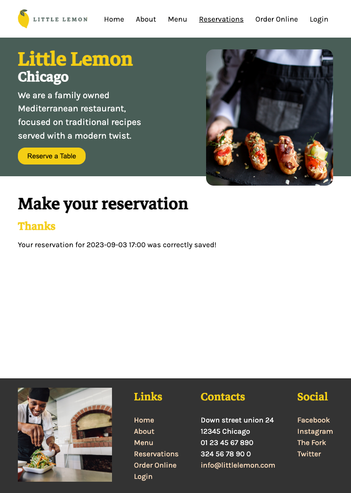

# Meta front-end developer certification

Final assignment for the Meta front-end developer certification.

As a final capstone for this specialization The Little Lemon restaurant website need a reservation page to allow customers to reserve a table.

Here's a preview:

## Home


## Reservations


## Reservation feedback



To start the project locally:

```
npm start
```